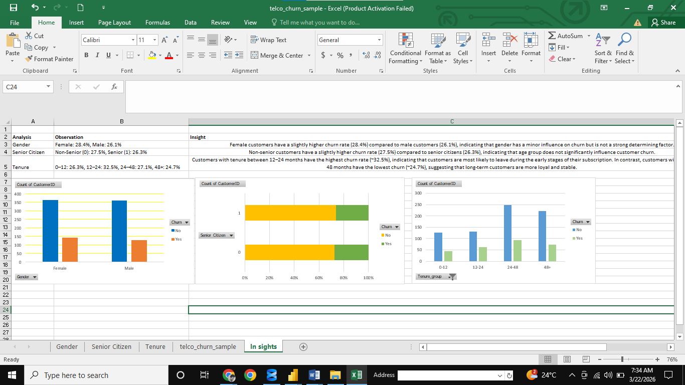

# Customer Churn Analysis

## 📊 Project Overview
This project analyzes customer churn data using Excel to identify key factors influencing customer retention and business decision-making.

## 🔍 Key Insights
- Customers with 12–24 months tenure have the highest churn (~32.5%)
- Long-term customers (48+ months) are more stable and loyal
- Gender and senior citizen status have minimal impact on churn

## 🛠 Tools Used
- Microsoft Excel
- Pivot Tables
- Data Cleaning
- Data Visualization

## 📈 Dashboard
An interactive Excel dashboard was created to visualize churn trends across different customer segments.

## 🎯 Conclusion
Customer tenure is the most significant factor influencing churn. Businesses should focus on improving retention strategies during the first two years of the customer lifecycle.

## 🚀 Skills Demonstrated
- Data Analysis
- Business Insight Generation
- Data Visualization
- Problem Solving
